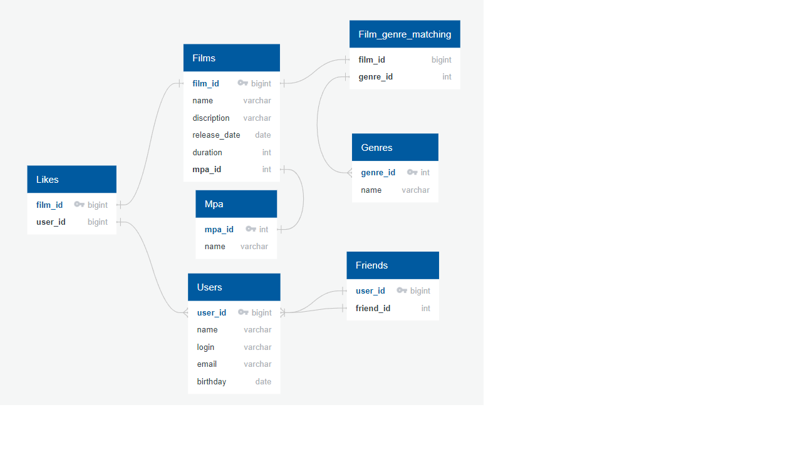

# java-filmorate
Template repository for Filmorate project.

Примеры запросов основных операций:
1. Получение всех фильмов:  

        SELECT *
        FROM films 

2. Получение списка всех пользователей: 

        SELECT *
        FROM users
   
3. Получение списка друзей пользователя по Id = N: 

    <pre><code>SELECT *
    FROM users AS us
    RIGHT JOIN friend_status AS fs ON us.user_id = fs.friend_id
    WHERE fs.user_id = N
          AND
    fs.friend_status = 'Friend'</code></pre>

4. Получение списка общих друзей пользователей с Id = N1 и Id = N2: 

<pre><code>SELECT *
FROM users AS us
WHERE us.user_id IN (SELECT fs.friend_id
                      FROM friend_status AS fs
                       WHERE fs.user_id = N1
                              AND
                              fs.friend_status = 'Friend')
      AND us.user_id IN (SELECT fs.friend_id
                         FROM friend_status AS fs
                         WHERE fs.user_id = N2
                               AND
fs.friend_status = 'Friend')</code></pre>

5. Получение N самых популярных фильмов 

<pre><code>SELECT *
FROM films AS f
RIGHT JOIN likes ON f.film_id = likes.film_id
GROUP BY film_id
ORDER BY COUNT(likes.user_id)
LIMIT N</code></pre>

